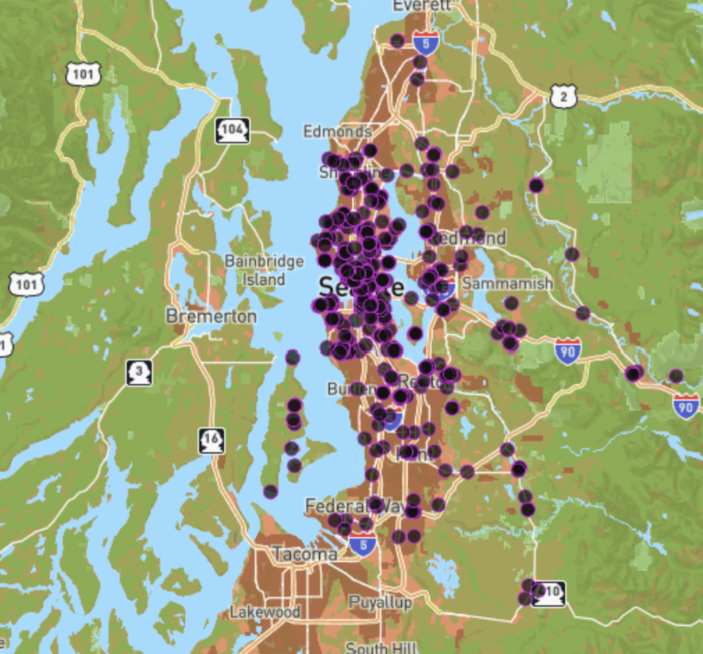
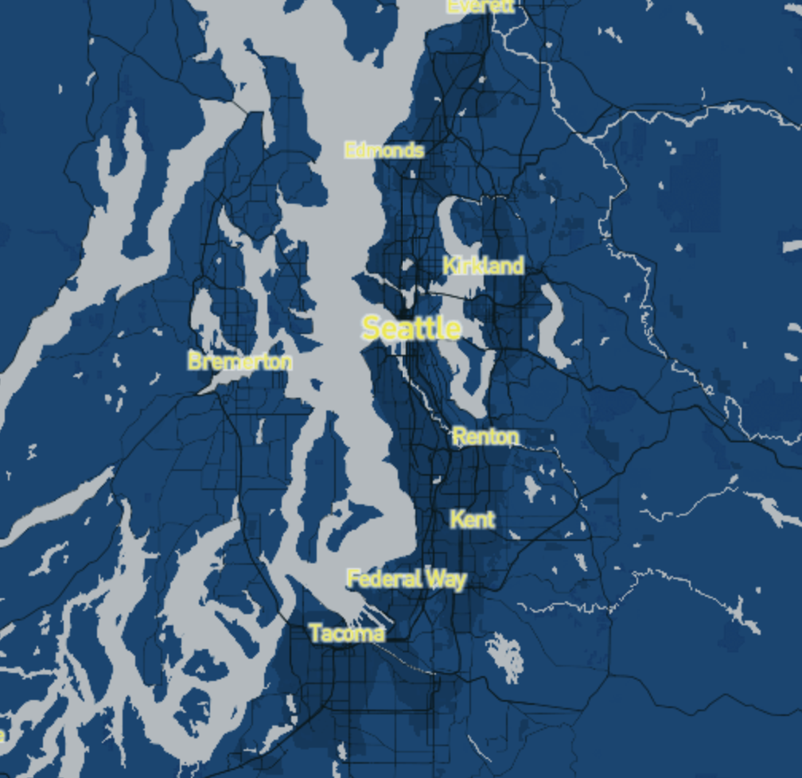

# lab-4

## Descriptions
For this lab i decided to use the dataset on comfort zones around Seattle published by King county.

## Maps
Basemap, created on Mapbox and imported to QGIS:

Map with bike locations only, imported into QGIS:

Compfort Zones with the base map, also imported into QGIS:

UW Themed Map, created on Mapbox and imported to QGIS:

