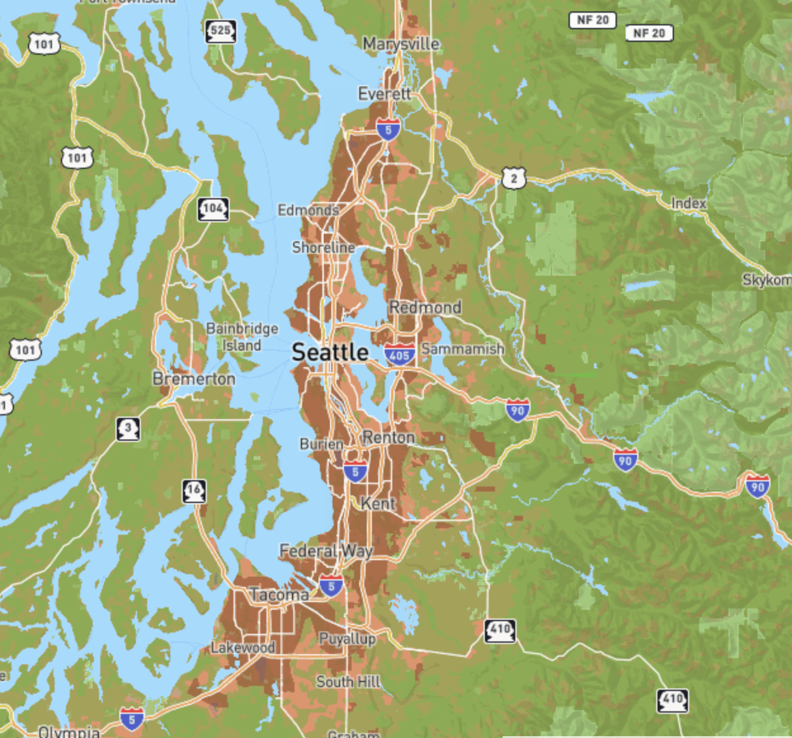

# lab-4

## Descriptions
For this lab i decided to use the dataset on comfort zones around Seattle published by King county. For my maps i implemented a minimum zoom level of 3 and maximum of 13. I created my individual maps on mapbox and imported the url's to QGIS, from which i exported the respective tiles into folders. I compiled all my maps as layers in my index.html file.

[Link to Github Pages Map](https://Anirit88.github.io/lab4/)

[Link to Map HTML](index.html)

## Maps
Basemap, created on Mapbox and imported to QGIS:

Map with Comfort Zones only, imported into QGIS:

Compfort Zones with the base map, also imported into QGIS:

UW Themed Map, created on Mapbox and imported to QGIS:

